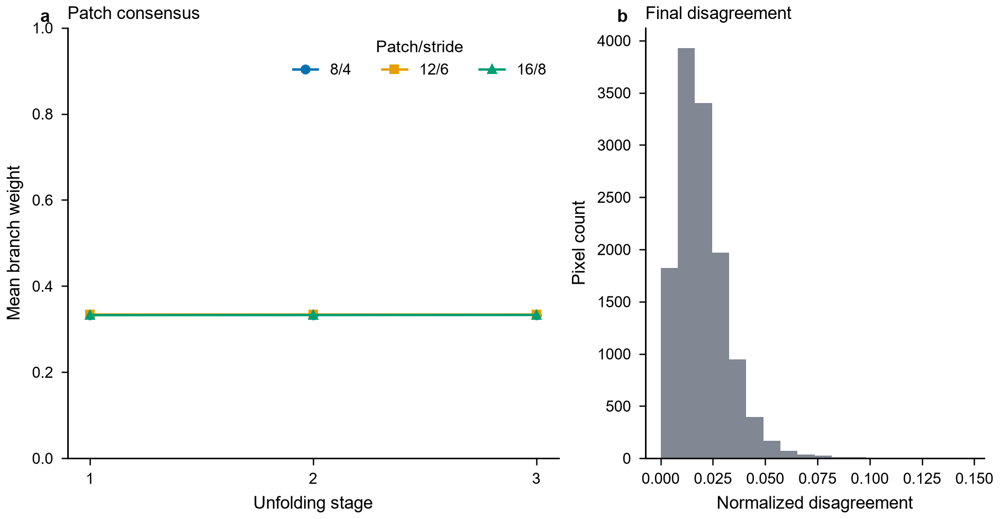
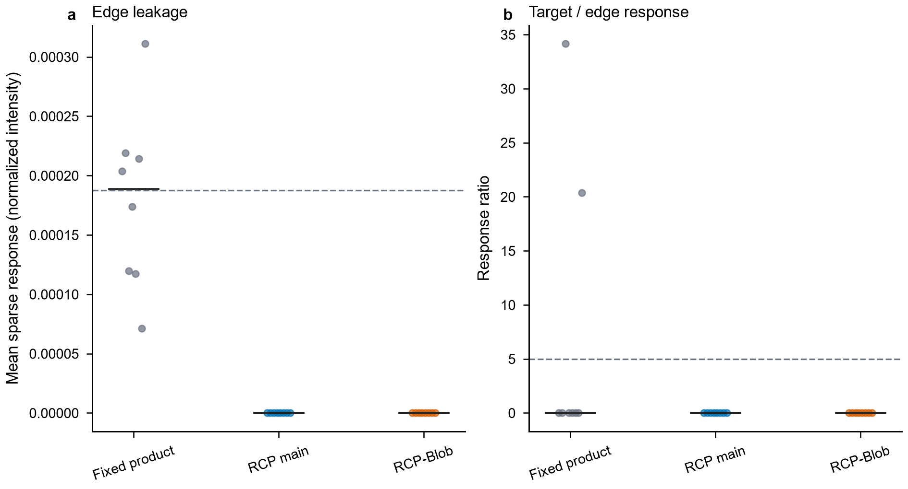
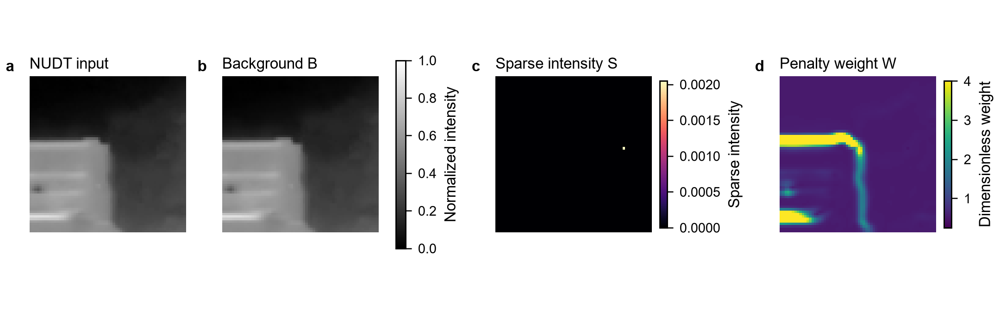
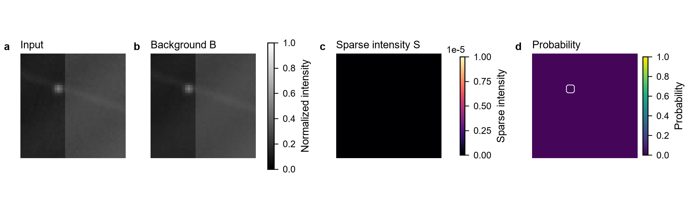

# RiRUFold_ADMM / RCP-RiRUFold：研究、训练、测试与诊断手册

> 新方法的论文创新表述、网络流程图、代码映射以及最新服务器训练/测试命令，统一以
> `创新方法与服务器复现指南.md` 为准。本文后半部分第 1–8 节保留的是旧
> `rirufold_admm` 基线说明，不应作为 RCP 主线的训练入口。

在 `RPCANet-main` 根目录运行以下命令。本目录保存新模型、脚本与方案文档；实际
模型注册和训练入口分别位于 `models/__init__.py` 与 `train.py`。

## 本轮新增：RCP-RiRUFold

新主线为 **Reliability-Calibrated Patch-Consensus RiRUFold**。它以三尺度重叠
patch-SVT 去噪锚点、分支不一致性、可靠性对数池化、有硬界的双侧学习校正、逐样本
`mu` 和 scaled-dual 重标为核心。物理稀疏强度 `S` 与分割 logits 已彻底分离：
Soft-IoU 使用 logits，`L_dc` 只使用 `aux["sparse_intensity"]`。

权威入口与实现：

| 内容 | 文件 |
|---|---|
| 建模合同、质疑与可证伪门槛 | `题目分析报告.md` |
| 符号、单位和禁用表述 | `术语表格.md` |
| RCP 主线和全部消融 | `models/rirufold_rcp.py` |
| 最小数值门禁 | `scripts/smoke_test_rirufold_rcp.py` |
| 服务器评测/诊断/汇总链路烟测 | `scripts/smoke_test_server_pipeline.py` |
| 合成机制研究、真实 trace、表格和候选图 | `scripts/run_rcp_research.py` |
| 服务器独立评测 | `scripts/evaluate_rirufold_rcp.py` |
| 服务器状态诊断 | `scripts/diagnose_rirufold_rcp.py` |
| 本地结论与支线裁决 | `研究记录.md` |
| 论文创新、网络图、服务器训练/测试 | `创新方法与服务器复现指南.md` |

### 本地复现

Windows 专用环境已放在本目录的 `.venv`（被 `.gitignore` 排除）：

```powershell
cd D:\python_DM\RPCANet-main\RiRUFold_ADMM
.\.venv\Scripts\python.exe scripts\smoke_test_rirufold_rcp.py
$env:MPLCONFIGDIR=(Resolve-Path '.').Path+'\.mplconfig'
.\.venv\Scripts\python.exe scripts\run_rcp_research.py
```

第二条命令使用固定 seed `20260910`，生成 `results/*.csv/json` 和
`figures/{raw,process,result}_q1_*`。这些是未训练机制结果，不是检测精度。

### 第一版核心结果图与论证图

下列图均由 `scripts/run_rcp_research.py` 从归档的 CSV/JSON 结果重新生成，仓库同时
保存 PNG（便于网页预览）与 SVG（便于论文排版）。它们验证的是模块数值行为和机制
方向；跨数据集检测精度必须按后文服务器命令重新训练后报告。

| 图 | 用途 |
|---|---|
|  | 说明多尺度 patch-SVT 如何形成背景共识及分支不一致性。 |
|  | 对照预注册门槛展示主线与消融的机制指标。 |
|  | 检查真实图像上的逐阶段残差、惩罚参数和权重演化。 |
|  | 展示背景、稀疏目标与重建残差的可解释分解。 |

完整图表口径见 `figure_contracts.md`，原始数值见 `results/`，本地结论和否证记录见
`研究记录.md`。特别地，Blob rescue 支线未通过虚警门禁，其负结果图仍保留，避免
只展示有利案例。

### 注册到服务器原工程

先备份服务器上的 `models/__init__.py` 与 `train.py`，再审阅并应用
`integration_reference/` 中的集成版本；将 `models/rirufold_rcp.py` 复制到服务器
原工程的 `models/`。集成版本新增 `--prox-weight`，并确保分解损失读取物理 `S`。
不要仅注册模型而继续使用旧训练损失，否则 logits/强度语义仍会混用。

服务器模型名：

| `--net-name` | 作用 | 默认进入正式矩阵 |
|---|---|---:|
| `rirufold_rcp` | 三尺度共识 + 可靠性 log-pool + dual feedback | 是 |
| `rirufold_rcp_product` | 固定 log-product 消融 | 是 |
| `rirufold_rcp_nofeedback` | 关闭 residual/dual feedback | 是 |
| `rirufold_rcp_global` | 整图 SVT 消融 | 是 |
| `rirufold_rcp_blob` | 各向同性亮点救援支线 | 否，本地门禁失败 |
| `rirufold_rcp_signed` | 亮/暗目标 signed 稀疏支线 | 仅在数据假设需要时 |

批量脚本默认比较旧 `rirufold_admm` 与四个 RCP 主线/消融，并使用三个种子：

```bash
cd /data/Student-25/ZhangYao/RPCANet-main
bash RiRUFold_ADMM/scripts/run_server_ablation.sh
```

当前 Blob 支线在本地存在明确权衡：`gamma_g>=0.20` 才出现稳健目标响应，但空场
超阈像素增量为 `0.453–1.070` 个百分点，高于 `0.1` 个百分点上限，因此默认脚本
不训练它。若只做探索性负结果复核，可显式设置 `INCLUDE_BLOB=1`，但不得把它当作
已通过的主贡献。

训练完成后，示例评测命令为：

```bash
python RiRUFold_ADMM/scripts/evaluate_rirufold_rcp.py \
  --net-name rirufold_rcp \
  --checkpoint result_rirufold_rcp/<run>/latest.pkl \
  --dataset nudt --data-root ./RiRUFold_ADMM/datasets \
  --seed 42 --stage-num 5 --hidden-channels 24 --batch-size 4 --gpu 0 \
  --output result_rirufold_rcp/<run>/test_metrics.json
```

评测脚本报告微聚合 mIoU/F1、8 邻域目标级 Pd、背景像素 Fa、参数量和单图耗时。
最终论文仍应按 `题目分析报告.md` 固定 split、训练预算与三个 seed，并报告配对
bootstrap 95% CI；单个 best checkpoint 数字不构成稳健改进证据。

## 1. 模型和脚本

| 内容 | 位置 | 用途 |
|---|---|---|
| 完整模型 | `models/rirufold_admm.py` | SVT/soft-threshold 锚点、背景条件 WLSE、对偶反馈。 |
| 独立评测 | `scripts/evaluate_rirufold_admm.py` | 输出 mIoU、F1、Pd、Fa。 |
| 阶段诊断 | `scripts/diagnose_rirufold_admm.py` | 导出 B、S、WLS、WSE、WLSE、残差。 |
| CPU 自检 | `scripts/smoke_test_rirufold_admm.py` | 不读数据集、不加载权重。 |

消融模型名：

| `--net-name` | 变化 |
|---|---|
| `rirufold_admm` | 背景条件 WLS + 动态 WSE + dual feedback。 |
| `rirufold_admm_nofeedback` | 移除 dual/residual feedback。 |
| `rirufold_admm_rawwls` | WLS 从原始输入而非恢复背景计算。 |
| `rirufold_admm_pointwse` | 移除 WLS，只保留动态 WSE。 |

## 2. 数据集格式与训练/测试划分

训练代码支持 `nudt`、`irstd1k`、`sirstaug`，并通过 `--data-root` 指向数据集
总目录。加载器不自动随机划分，训练和测试由下列目录或 split 文件严格决定。

| 参数 | 数据目录 | 训练集 | 独立测试集 |
|---|---|---|---|
| `nudt` | `NUDT-SIRST/` | `trainval/images,masks` | `test/images,masks` |
| `irstd1k` | `IRSTD-1k/` | `trainval/images,masks`，或官方 `trainval.txt` | `test/images,masks`，或官方 `test.txt` |
| `sirstaug` | `sirst_aug/` | `trainval/images,masks` | `test/images,masks` |

### 2.1 标准结构

```text
datasets/<dataset>/
├── trainval/images/*.png
├── trainval/masks/*.png
├── test/images/*.png
└── test/masks/*.png
```

### 2.2 IRSTD-1K 官方列表格式

代码已兼容你当前的数据格式：

```text
datasets/IRSTD-1k/IRSTD-1k/
├── IRSTD1k_Img/XDU*.png
├── IRSTD1k_Label/XDU*.png
├── trainval.txt
└── test.txt
```

加载器会自动进入内层 `IRSTD-1k/`，按 `trainval.txt` 训练，按 `test.txt` 独立
评测。当前本地核对：训练 800 张，测试 201 张。

### 2.3 NUDT-SIRST 注意事项

若 NUDT-SIRST 只有根目录 `images/masks`，但没有 `trainval/test` 或明确 split
文件，不能安全训练和独立测试。请先恢复官方划分，不能把同一批图同时用于训练和
测试。

### 2.4 当前归档数据的直接用法

本机 `RiRUFold_ADMM/datasets/NUDT-SIRST/` 已包含可直接读取的标准划分：

```text
trainval: 663 对 image/mask
test:     664 对 image/mask
```

因此，若服务器也保留同样的归档目录，下面 NUDT 命令应使用：

```bash
--data-root ./RiRUFold_ADMM/datasets
```

不要同时把 `./datasets/NUDT-SIRST` 的未划分根目录和
`./RiRUFold_ADMM/datasets/NUDT-SIRST` 的已划分目录混用。

## 3. 运行前 CPU 自检

```bash
cd /data/Student-25/ZhangYao/RPCANet-main
python scripts/smoke_test_rirufold_admm.py
```

预期最后一行：`RiRFoldADMM CPU smoke test passed.`

## 4. 训练命令

参数含义：`Seg` 为 SoftIoU 损失，`DC` 为 `mean(abs(X-B-S))`，`BG` 为非目标区
背景损失。SVT 显存较高，若 OOM，先把 batch size 由 4 改为 2。

### NUDT-SIRST

```bash
cd /data/Student-25/ZhangYao/RPCANet-main
CUDA_VISIBLE_DEVICES=0 python train.py \
  --net-name rirufold_admm --dataset nudt \
  --data-root ./RiRUFold_ADMM/datasets \
  --epochs 400 --lr 1e-4 --batch-size 4 --gpu 0 \
  --admm-stage-num 5 --admm-hidden-channels 24 \
  --dc-weight 0.05 --bg-weight 0.02 \
  --save-iter-step 100 --log-per-iter 10 \
  --base-dir ./result_rirufold_admm
```

### IRSTD-1K

```bash
cd /data/Student-25/ZhangYao/RPCANet-main
CUDA_VISIBLE_DEVICES=1 python train.py \
  --net-name rirufold_admm --dataset irstd1k --data-root ./datasets \
  --epochs 400 --lr 1e-4 --batch-size 4 --gpu 1 \
  --admm-stage-num 5 --admm-hidden-channels 24 \
  --dc-weight 0.05 --bg-weight 0.02 \
  --save-iter-step 100 --log-per-iter 10 \
  --base-dir ./result_rirufold_admm
```

### SIRST-Aug

```bash
cd /data/Student-25/ZhangYao/RPCANet-main
CUDA_VISIBLE_DEVICES=2 python train.py \
  --net-name rirufold_admm --dataset sirstaug --data-root ./datasets \
  --epochs 400 --lr 1e-4 --batch-size 4 --gpu 2 \
  --admm-stage-num 5 --admm-hidden-channels 24 \
  --dc-weight 0.05 --bg-weight 0.02 \
  --save-iter-step 100 --log-per-iter 10 \
  --base-dir ./result_rirufold_admm
```

`CUDA_VISIBLE_DEVICES=N` 和 `--gpu N` 填物理 GPU 编号。代码内部会将选定的卡
映射为 `cuda:0`，因此非零 GPU 编号可正常使用。

## 5. 训练输出

每个实验单独保存：

```text
result_rirufold_admm/<time>_rirufold_admm_<dataset>/
├── log.txt
├── events.out.tfevents.*
├── latest.pkl
└── best.pkl
```

`best.pkl` 按训练过程中的 test split mIoU 最优保存。注意：当前代码没有单独的
validation split，训练期间的权重选择和下面的复测都使用同一个 `test` split。因此，
下面的脚本属于“独立脚本复测”，不是严格意义上完全独立的模型选择。

若论文需要严格的 train/validation/test 三分设置，应另外准备 validation 列表，
并禁止使用 test mIoU 选择 `best.pkl`。论文最终数字仍须使用下面的复测命令重新测试，
并保留终端输出。

## 6. 独立测试 best.pkl

### NUDT-SIRST

```bash
CUDA_VISIBLE_DEVICES=0 python scripts/evaluate_rirufold_admm.py \
  --net-name rirufold_admm \
  --checkpoint ./result_rirufold_admm/<time>_rirufold_admm_nudt/best.pkl \
  --dataset nudt --data-root ./RiRUFold_ADMM/datasets \
  --batch-size 4 --stage-num 5 --hidden-channels 24 --gpu 0
```

### IRSTD-1K

```bash
CUDA_VISIBLE_DEVICES=1 python scripts/evaluate_rirufold_admm.py \
  --net-name rirufold_admm \
  --checkpoint ./result_rirufold_admm/<time>_rirufold_admm_irstd1k/best.pkl \
  --dataset irstd1k --data-root ./datasets \
  --batch-size 4 --stage-num 5 --hidden-channels 24 --gpu 1
```

### SIRST-Aug

```bash
CUDA_VISIBLE_DEVICES=2 python scripts/evaluate_rirufold_admm.py \
  --net-name rirufold_admm \
  --checkpoint ./result_rirufold_admm/<time>_rirufold_admm_sirstaug/best.pkl \
  --dataset sirstaug --data-root ./datasets \
  --batch-size 4 --stage-num 5 --hidden-channels 24 --gpu 2
```

输出为 `mIoU / precision / recall / F1 / Pd / Fa`，其中 Fa 为 `10^-6 per pixel`。

## 7. 阶段诊断

```bash
CUDA_VISIBLE_DEVICES=0 python scripts/diagnose_rirufold_admm.py \
  --net-name rirufold_admm \
  --checkpoint ./result_rirufold_admm/<time>_rirufold_admm_nudt/best.pkl \
  --image ./RiRUFold_ADMM/datasets/NUDT-SIRST/test/images/000017.png \
  --stage-num 5 --hidden-channels 24 --gpu 0 \
  --out-dir ./analysis_outputs/rirufold_admm_nudt_000017
```

IRSTD-1K 官方格式示例图像：

```text
./datasets/IRSTD-1k/IRSTD-1k/IRSTD1k_Img/XDU189.png
```

输出含 `stage_XX_background/sparse/w_ls/w_se/w_lse/primal_residual.png` 与
`stage_summary.csv`，可绘制 primal residual、dual residual、mu 和 alpha 曲线。

## 8. 消融规则

仅改变 `--net-name`，其余数据划分、随机种子、epoch、学习率、batch size、stage
数、隐藏通道全部保持一致。训练或测试变体时，命令中的 `--net-name` 必须与权重
对应，否则 state dict 不匹配。

最终至少报告 mIoU、F1、Pd、Fa、参数量、推理时间、最终 primal residual 和 final
dual residual。若完整模型未呈现更低或更稳定的残差，不应在论文中称反馈分支“保证”
分解一致性。
