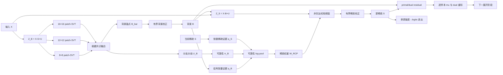

# RCP-RiRUFold：论文创新、网络实现与服务器复现指南

本文档是新方法的唯一运行入口。它同时回答四个问题：两篇根源论文如何融合、创新
如何写入论文、创新如何落到网络代码、服务器如何训练和测试。完整数学合同见
`题目分析报告.md`，本地证据与负结果见 `研究记录.md`。

## 1. 一句话主线

**RCP-RiRUFold 将 RiRUFold 的低秩—重加权稀疏展开骨架，与 TKDE 论文中“多信息
源显式建模—交替更新—残差反馈—边界验证”的方法论结合，利用多个低秩 patch
视角的分歧估计结构证据可靠性，再以可靠性校准的对数几何池化控制稀疏阈值。**

这句话对应网络中的连续因果链，而不是几个模块的并列拼装：

```text
多尺度低秩背景视角
        ↓
分支共识与分歧 U_B
        ↓
结构证据可信度 π_B
        ↓
背景结构证据 q_B 与稀疏状态证据 q_S 的可靠性池化
        ↓
逐像素稀疏阈值 W_RCP
        ↓
目标/背景分解与残差反馈
```

## 2. 两篇论文不是简单拼接，而是“骨架—原则—新机制”融合

| 层次 | 来自哪里 | 保留内容 | 本方法中的新落点 |
|---|---|---|---|
| 问题骨架 | `manuscript_zb.pdf` | 单帧红外图像的低秩背景、重加权稀疏目标、展开式求解 | 保留 `B/S/U/W` 可解释状态，但修正整图 SVD、状态量纲和 batch 耦合 |
| 设计原则 | `TKDE-2026-08-2894_Proof_hi (1).pdf` | 不同信息源必须进入显式目标/更新；交替更新需给出残差、边界和验证 | 把“背景结构信息”和“当前稀疏信息”写成两个显式证据，并用可诊断可靠性耦合 |
| 新机制 | 本研究 | 两篇论文都没有直接给出 | 多尺度 patch 低秩分歧 `U_B` 反向控制结构证据指数 `π_B`，形成可靠性校准阈值 |

因此论文不能写成“把 SCLT 网络直接移植到 RiRUFold”。准确表述是：借鉴第二篇
论文的多源显式建模与交替验证范式，重新设计第一篇论文中的低秩—稀疏展开关系。

## 3. 建议写入论文的贡献点

### 3.1 核心贡献：可靠性校准的多源稀疏阈值

三个 patch-SVT 背景分支先产生稳健共识背景和归一化分歧 `U_B`。背景分支越一致，
结构张量证据越可信；分支越冲突，结构证据权重自动下降：

\[
\pi_B^{k+1}=\sigma(a_0-a_u U_B^{k+1}).
\]

结构证据 `q_B` 与当前稀疏状态证据 `q_S` 不再固定相乘，而在 log 域按可靠性进行
几何池化：

\[
W_{RCP}^{k+1}=\operatorname{clip}\left(
\frac{\exp[\pi_B q_B+(1-\pi_B)q_S]}
{\operatorname{mean}_{hw}\exp[\pi_B q_B+(1-\pi_B)q_S]},
0.25,4.0\right).
\]

这里的创新关系是“低秩背景是否可信”直接决定“结构先验应该相信多少”。它可由
`rirufold_rcp_product` 消融证伪；固定乘积不是主模型。

### 3.2 支撑贡献：多尺度块低秩共识锚点

对 `(patch,stride)=(8,4),(12,6),(16,8)` 分别执行

\[
\bar B_s=P_s^\dagger\operatorname{SVT}_{\tau_s/\mu}(P_s Z_B),
\]

再以到逐像素中位中心的偏差生成三分支 softmax 权重。该设计把细、中、大邻域的
块自相似性显式保留，并以分支方差生成上节的可靠性代理。

论文必须称它为 **three-scale patch-SVT denoising anchor**，不能称重叠块核范数的
精确 proximal，也不能把三个 patch 尺度写成三个 tensor modes。整图 SVD 对照为
`rirufold_rcp_global`。

### 3.3 支撑贡献：显式近端锚点周围的硬有界学习

背景和稀疏两侧均采用

\[
\delta=\gamma\,a_{local}\tanh(g_\theta),\qquad 0<\gamma<0.20,
\]

所以每个像素的学习校正满足 `|δ|≤0.20*a_local`。这使网络既保留数据驱动能力，
又不会让自由卷积在数值上完全覆盖低秩/稀疏锚点。训练损失中的 `L_prox` 进一步
惩罚长期顶住硬界，但硬界本身由网络参数化保证，不依赖正则项碰巧有效。

### 3.4 一致性贡献：逐样本残差平衡与物理量/判别量分离

`mu` 固定为 `B×1×1×1`，逐样本依据 primal/dual residual 更新；更新后用
`mu_old/mu_new` 重标 scaled dual。物理稀疏强度 `S` 仅进入
`X-B-S`，分割 logits 则由对 `S` 严格单调的读出产生：

\[
\ell=a(S/\rho_X-b),\qquad a>0,\quad \rho_X\ge0.01.
\]

这部分主要是数学—代码一致性修复，可作为方法可靠性贡献，但不应单独夸大成全新
优化理论；模型是 **ADMM-inspired preconditioned unfolding**，没有经典凸 ADMM
的全局收敛保证。

## 4. 网络结构及代码映射



| 论文模块 | 代码对象 | 关键输出/检查 |
|---|---|---|
| patch-SVT 与 fold | `overlapping_patch_svt`、`PatchConsensusAnchor` | `patch_anchors`、`branch_weights`、`uncertainty` |
| 固定结构张量 | `FixedStructureTensor` | `coherence`、`energy`、`blob_response` |
| 可靠性证据池化 | `ReliabilityCalibratedWeight` | `q_background`、`q_sparse`、`reliability`、`w_rcp` |
| 双侧硬界校正 | `BoundedCorrection` | `background_delta`、`sparse_delta` 与各自 bound |
| 单阶段交替更新 | `RCPUnfoldStage.forward` | `primal_norm`、`dual_norm`、`mu_next`、`alpha` |
| 多阶段与 logits 读出 | `RCPRiRUFold.forward` | `(background, logits)`；训练另返回 `sparse_intensity` |
| 训练目标 | `integration_reference/train.py::compute_loss` | Soft-IoU + DC + BG + Prox，不混用 logits 和强度 |

主代码为 `models/rirufold_rcp.py`。诊断接口
`model(image, return_trace=True)` 会导出每阶段状态，论文图应从这些真实状态生成。

## 5. 主线、消融和支线

| `--net-name` | 唯一变化 | 回答的论文问题 | 正式矩阵 |
|---|---|---|---:|
| `rirufold_admm` | 原整图低秩与固定方案 | 新设计整体是否优于当前改进基线 | 是 |
| `rirufold_rcp_product` | 用固定 log-product 代替可靠性指数 | `U_B→π_B→W` 是否有效 | 是 |
| `rirufold_rcp` | 完整 RCP 主线 | 核心模型 | 是 |
| `rirufold_rcp_nofeedback` | 关闭 residual/dual feedback | 反馈是否改善精度或稳定性 | 是 |
| `rirufold_rcp_global` | 三尺度 patch 锚点改回整图 SVT | patch 共识是否必要 | 是 |
| `rirufold_rcp_blob` | 加各向同性亮点救援 | 强边缘附近目标能否进一步恢复 | 否，本地门禁失败 |
| `rirufold_rcp_signed` | 非负阈值改为 signed 阈值 | 含暗目标时的假设支线 | 仅适用数据集需要时 |

Blob 支线已保留为负结果：本地扫描中，能产生稳健目标响应的系数同时令空场激活
超过预注册上限。因此它不是当前主贡献，只有设置 `INCLUDE_BLOB=1` 才会训练。

## 6. 服务器集成

以下命令均从服务器 `RPCANet-main` 根目录运行。先保留原文件，再应用已经审阅的
集成版本：

```bash
cd /data/Student-25/ZhangYao/RPCANet-main
cp models/__init__.py models/__init__.py.before_rcp
cp train.py train.py.before_rcp
cp RiRUFold_ADMM/models/rirufold_rcp.py models/rirufold_rcp.py
cp RiRUFold_ADMM/integration_reference/models___init__.py models/__init__.py
cp RiRUFold_ADMM/integration_reference/train.py train.py
python -m py_compile models/rirufold_rcp.py models/__init__.py train.py
```

集成后必须确认训练帮助中出现 `--prox-weight` 和 `--run-name`：

```bash
python train.py --help | grep -E "prox-weight|run-name"
```

依赖沿用原工程固定环境。若服务器环境已经能训练 RPCANet，不要为了本方法随意升级
PyTorch；先执行下一节自检。模型使用的 `torch.linalg.svd` 需要项目约定的
PyTorch 1.8 或更高版本。

## 7. 训练前自检

```bash
cd /data/Student-25/ZhangYao/RPCANet-main
python RiRUFold_ADMM/scripts/smoke_test_rirufold_rcp.py
python RiRUFold_ADMM/scripts/smoke_test_server_pipeline.py
python RiRUFold_ADMM/scripts/evaluate_rirufold_rcp.py --help
python RiRUFold_ADMM/scripts/diagnose_rirufold_rcp.py --help
python RiRUFold_ADMM/scripts/summarize_server_results.py --help
```

烟测退出码必须为 0；它会检查非整除尺寸的 patch-fold、随机与平坦输入反向、batch
不变性、硬界、逐样本 `mu`、logits 单调性、消融接口和一张真实 NUDT 图像链路；
第二个烟测还会以临时未训练权重贯通“单图评测—阶段诊断—跨 seed 汇总”三个 CLI。

## 8. 单个配置训练命令

固定设置为 5 个展开阶段、24 个隐藏通道、400 epoch、学习率 `1e-4`、batch 4。
显存不足时可把所有模型的 batch 同时改为 2，不能只改主模型。

### 8.1 NUDT-SIRST

```bash
CUDA_VISIBLE_DEVICES=0 python train.py \
  --net-name rirufold_rcp --dataset nudt \
  --data-root ./RiRUFold_ADMM/datasets \
  --base-size 256 --crop-size 256 \
  --epochs 400 --lr 1e-4 --batch-size 4 --gpu 0 --seed 42 \
  --admm-stage-num 5 --admm-hidden-channels 24 \
  --dc-weight 0.05 --bg-weight 0.02 --prox-weight 0.005 \
  --save-iter-step 100 --log-per-iter 10 \
  --base-dir ./result_rirufold_rcp \
  --run-name seed_42/nudt/rirufold_rcp
```

### 8.2 IRSTD-1K

```bash
CUDA_VISIBLE_DEVICES=0 python train.py \
  --net-name rirufold_rcp --dataset irstd1k --data-root ./datasets \
  --base-size 256 --crop-size 256 \
  --epochs 400 --lr 1e-4 --batch-size 4 --gpu 0 --seed 42 \
  --admm-stage-num 5 --admm-hidden-channels 24 \
  --dc-weight 0.05 --bg-weight 0.02 --prox-weight 0.005 \
  --save-iter-step 100 --log-per-iter 10 \
  --base-dir ./result_rirufold_rcp \
  --run-name seed_42/irstd1k/rirufold_rcp
```

### 8.3 SIRST-Aug

```bash
CUDA_VISIBLE_DEVICES=0 python train.py \
  --net-name rirufold_rcp --dataset sirstaug --data-root ./datasets \
  --base-size 256 --crop-size 256 \
  --epochs 400 --lr 1e-4 --batch-size 4 --gpu 0 --seed 42 \
  --admm-stage-num 5 --admm-hidden-channels 24 \
  --dc-weight 0.05 --bg-weight 0.02 --prox-weight 0.005 \
  --save-iter-step 100 --log-per-iter 10 \
  --base-dir ./result_rirufold_rcp \
  --run-name seed_42/sirstaug/rirufold_rcp
```

只允许改 `--net-name` 形成同一数据集内消融，其余预算、seed、尺寸和损失权重必须
一致。`latest.pkl` 是固定 400 epoch 的末轮权重；`best.pkl` 由当前训练器依据 test
split 选择，存在测试集模型选择偏差。论文主表优先使用 `latest.pkl`；若沿用
`best.pkl` 与旧工作比较，必须公开说明该协议且所有模型完全一致。

## 9. 三数据集 × 三种子 × 五模型一键实验

默认共 `3×3×5=45` 次训练，训练后自动评测 `latest.pkl` 并生成汇总表：

```bash
cd /data/Student-25/ZhangYao/RPCANet-main
GPU_ID=0 \
DATA_ROOT=./datasets \
NUDT_DATA_ROOT=./RiRUFold_ADMM/datasets \
OUTPUT_ROOT=./result_rirufold_rcp_main \
EPOCHS=400 \
SEEDS="42 3407 2026" \
bash RiRUFold_ADMM/scripts/run_server_ablation.sh
```

正式日志应保留完整命令。若只想先做 1 epoch 链路验证：

```bash
GPU_ID=0 OUTPUT_ROOT=./result_rirufold_rcp_dryrun EPOCHS=1 SEEDS="42" \
bash RiRUFold_ADMM/scripts/run_server_ablation.sh
```

脚本检测到同名运行目录会退出，避免覆盖。重新运行时请更换 `OUTPUT_ROOT`，或明确
归档旧目录后再启动。只训练、不立即评测可设 `EVALUATE_AFTER_TRAIN=0`。探索 Blob
负结果时额外设 `INCLUDE_BLOB=1`。

## 10. 独立测试命令

以下以 NUDT、seed 42、末轮权重为例：

```bash
CUDA_VISIBLE_DEVICES=0 python RiRUFold_ADMM/scripts/evaluate_rirufold_rcp.py \
  --net-name rirufold_rcp \
  --checkpoint ./result_rirufold_rcp/seed_42/nudt/rirufold_rcp/latest.pkl \
  --dataset nudt --seed 42 \
  --data-root ./RiRUFold_ADMM/datasets \
  --base-size 256 --batch-size 4 \
  --stage-num 5 --hidden-channels 24 \
  --threshold 0.5 --gpu 0 \
  --output ./result_rirufold_rcp/metrics/seed_42/nudt/rirufold_rcp.json
```

IRSTD-1K 与 SIRST-Aug 只需分别替换为：

```text
--dataset irstd1k --data-root ./datasets
--dataset sirstaug --data-root ./datasets
```

评测 JSON 包含 seed、mIoU、precision、recall、F1、8 邻域目标级 Pd、背景像素
Fa（`10^-6/pixel`）、参数量、单图耗时、checkpoint SHA-256 和测试划分 SHA-256。
若 checkpoint 路径含 `seed_N`，脚本还会强制它与 `--seed N` 一致。
`--net-name`、`stage-num`、`hidden-channels` 必须与 checkpoint 完全一致。

已有多个评测 JSON 时，汇总命令为：

```bash
python RiRUFold_ADMM/scripts/summarize_server_results.py \
  --input-root ./result_rirufold_rcp/metrics \
  --output ./result_rirufold_rcp/summary.csv
```

汇总器会拒绝重复的“数据集—模型—seed”记录，输出各指标均值、样本标准差和种子数。

## 11. 阶段诊断命令

```bash
CUDA_VISIBLE_DEVICES=0 python RiRUFold_ADMM/scripts/diagnose_rirufold_rcp.py \
  --net-name rirufold_rcp \
  --checkpoint ./result_rirufold_rcp/seed_42/nudt/rirufold_rcp/latest.pkl \
  --image ./RiRUFold_ADMM/datasets/NUDT-SIRST/test/images/000001.png \
  --base-size 256 --stage-num 5 --hidden-channels 24 --gpu 0 \
  --out-dir ./result_rirufold_rcp/diagnostics/seed_42/nudt/000001
```

输出包括每阶段 `B/S/B_bar/S_bar/U_B/W_RCP/q_B/q_S/π_B/threshold/residual` 图与
`stage_summary.csv`。建议论文至少展示一张低 SCR、一张强边缘邻近目标和一张高
背景杂波图，不能只选最漂亮样例。

## 12. 论文结果成立条件

主线相对 `rirufold_rcp_product` 的预注册支持门槛是：至少 2/3 数据集的三种子
平均 mIoU 提高不低于 0.30 个百分点，Fa 相对增加不超过 5%，且高结构/低 SCR
子集的 Fa 相对降低至少 5% 或 Pd 提高至少 0.50 个百分点。

若只降低分解残差而检测指标未达门槛，结论应写成“优化一致性改善但检测收益未获
支持”。若 RCP 不优于 product，应保留负结果并检查 `U_B` 是否与错误结构证据真正
相关，而不是事后更改门槛。最终表还应报告显存峰值与耗时，因为三尺度 SVD 的代价
不能用参数量替代。

## 13. 本地已验证与尚未验证

- 已验证：CPU 前向/反向有限、平坦输入 SVD 反向稳定、patch fold 误差
  `1.1920929e-6`、batch 组成不改变单样本输出、硬界与逐样本 `mu` 成立。
- 已验证：未训练合成场景上 RCP 初始化的强边缘泄漏低于固定乘积；这只是机制方向。
- 已否定：Blob 支线当前强度不能同时满足目标响应和空场激活门槛。
- 尚未验证：训练后的 mIoU/F1/Pd/Fa、跨数据集稳定性、显存和 GPU 耗时；这些必须
  使用上面的服务器命令生成，不能由本地未训练结果替代。
